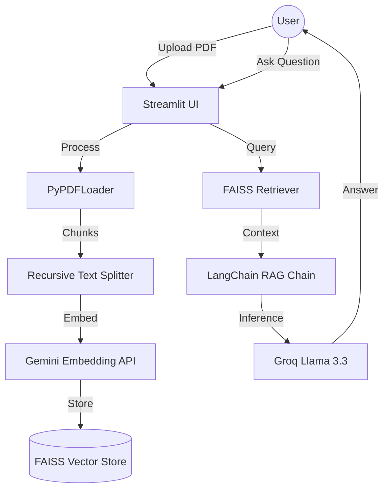

# 📄 DocuQA: Enterprise-Grade AI PDF Chatbot


## 🌟 Overview
**DocuQA** is a high-performance, production-ready AI application that allows users to upload multiple PDF documents and engage in intelligent, context-aware conversations. It leverages **Retrieval-Augmented Generation (RAG)** with ultra-fast inference via **Groq** and robust embeddings from **Google Gemini**.

This repository follows industry-standard **LLMOps**, **DevOps**, and **GitOps** practices, featuring a fully automated CI/CD pipeline and Kubernetes-native deployment.

---

## 🏗 Architecture


---

## 🚀 Features
- **Multi-Provider AI**: Supports **Groq (Llama 3.3)** and **Google Gemini (2.0 Flash)**.
- **RAG Pipeline**: Advanced document chunking and retrieval using **FAISS**.
- **Production UI**: Premium dark-themed Streamlit interface with sidebar management.
- **Scalable Infrastructure**: Containerized with **Docker** and orchestrated by **Kubernetes**.
- **GitOps Workflow**: Automated deployments via **ArgoCD**.
- **Observability**: Built-in logging and health checks.

---

## 🛠 Tech Stack
| Category | Technology |
| :--- | :--- |
| **Frontend/App** | Streamlit |
| **AI Framework** | LangChain |
| **LLM Provider** | Groq (Llama 3.3), Google Gemini |
| **Embeddings** | Google Gemini (text-embedding-004) |
| **Vector DB** | FAISS |
| **Containerization** | Docker |
| **Orchestration** | Kubernetes (Kind Cluster) |
| **CI/CD** | GitHub Actions |
| **GitOps** | ArgoCD |

---

## 🛠️ Tool Installation Guide

Before starting, ensure you have the following tools installed. If not, follow these quick guides:

### 1. Docker & Docker Compose
- **Windows/Mac**: Install [Docker Desktop](https://www.docker.com/products/docker-desktop/).
- **Linux**:
  ```bash
  sudo apt update && sudo apt install docker.io docker-compose -y
  sudo usermod -aG docker $USER && newgrp docker
  ```

### 2. Kubernetes CLI (kubectl)
- **Windows (Chocolatey)**: `choco install kubernetes-cli`
- **Mac (Homebrew)**: `brew install kubectl`
- **Linux**:
  ```bash
  curl -LO "https://dl.k8s.io/release/$(curl -L -s https://dl.k8s.io/release/stable.txt)/bin/linux/amd64/kubectl"
  chmod +x kubectl && sudo mv kubectl /usr/local/bin/
  ```

### 3. Local K8s Cluster (Kind)
- **Installation**:
  ```bash
  # Go
  go install sigs.k8s.io/kind@v0.20.0
  # Mac/Linux (Binary)
  curl -Lo ./kind https://kind.sigs.k8s.io/dl/v0.20.0/kind-linux-amd64
  chmod +x ./kind && sudo mv ./kind /usr/local/bin/
  ```

### 4. ArgoCD CLI
- **Installation**:
  ```bash
  curl -sSL -o argocd-linux-amd64 https://github.com/argoproj/argo-cd/releases/latest/download/argocd-linux-amd64
  sudo install -m 555 argocd-linux-amd64 /usr/local/bin/argocd
  rm argocd-linux-amd64
  ```

---

## 🚀 End-to-End Execution Guide

Follow these steps to deploy the application from scratch:

### Step 1: Clone & Configure
```bash
git clone https://github.com/bittush8789/Groq-PDF-Assistant.git
cd Groq-PDF-Assistant

# Create .env file
cat <<EOF > .env
GEMINI_API_KEY=your_gemini_key
GROQ_API_KEY=your_groq_key
EOF
```

### Step 2: Local Development (Optional)
```bash
python -m venv venv
source venv/bin/activate  # Windows: venv\Scripts\activate
pip install -r requirements.txt
streamlit run app.py
```

### Step 3: Containerize & Test
```bash
# Build the production image
docker build -t docuqa-app:v1 .

# Run locally via Docker
docker run -p 8501:8501 --env-file .env docuqa-app:v1
```

### Step 4: Deploy to Kubernetes (Kind)
```bash
# 1. Create Cluster
kind create cluster --name docuqa-cluster

# 2. Load Image into Kind (If using local image)
kind load docker-image docuqa-app:v1 --name docuqa-cluster

# 3. Create Namespace
kubectl create namespace docuqa

# 4. Apply Manifests
kubectl apply -f k8s/resources.yaml
kubectl apply -f k8s/deployment.yaml

# 5. Verify & Access
kubectl get all -n docuqa
kubectl port-forward svc/docuqa-service 8501:80 -n docuqa
```

### Step 5: Setup GitOps (ArgoCD)
```bash
# 1. Install ArgoCD in Cluster
kubectl create namespace argocd
kubectl apply -n argocd -f https://raw.githubusercontent.com/argoproj/argo-cd/stable/manifests/install.yaml

# 2. Access ArgoCD UI
kubectl port-forward svc/argocd-server -n argocd 8080:443

# 3. Deploy the App via ArgoCD
kubectl apply -f argocd/application.yaml
```

---

## 🔐 Security Best Practices
- **Non-Root Container**: Dockerfile runs as a non-privileged `streamlit` user.
- **Secret Management**: API keys are handled via K8s Secrets and ConfigMaps.
- **Health Checks**: Liveness and Readiness probes configured in Kubernetes.

---

## 🤝 Contributing
Contributions are welcome! Please open an issue or submit a pull request.

---

## 📄 License
Distributed under the MIT License. See `LICENSE` for more information.
