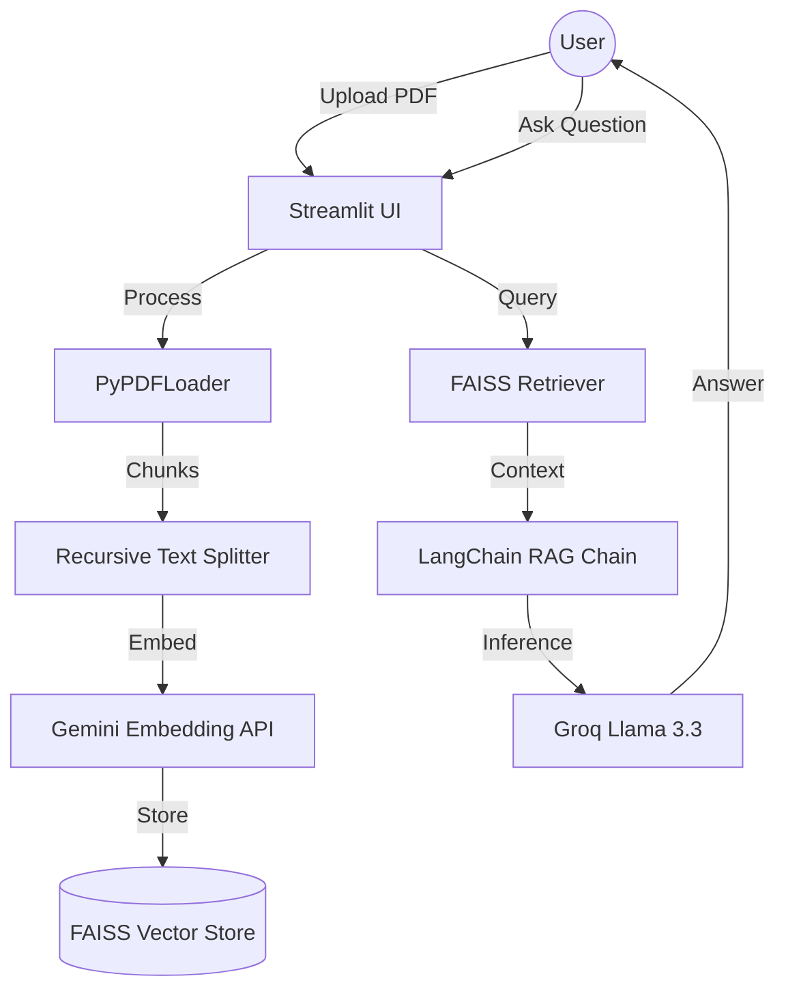

# 📄 DocuQA: Enterprise-Grade AI PDF Chatbot

## 🌟 Overview
**DocuQA** is a high-performance, production-ready AI application that allows users to upload multiple PDF documents and engage in intelligent, context-aware conversations. It leverages **Retrieval-Augmented Generation (RAG)** with ultra-fast inference via **Groq** and robust embeddings from **Google Gemini**.

This repository follows industry-standard **LLMOps**, **DevOps**, and **GitOps** practices, featuring a fully automated CI/CD pipeline and Kubernetes-native deployment.

---

## 🏗 Architecture

---

## 🚀 Features
- **Multi-Provider AI**: Supports **Groq (Llama 3.3)** and **Google Gemini (2.0 Flash)**.
- **RAG Pipeline**: Advanced document chunking and retrieval using **FAISS**.
- **Production UI**: Premium dark-themed Streamlit interface with sidebar management.
- **Scalable Infrastructure**: Containerized with **Docker** and orchestrated by **Kubernetes**.
- **GitOps Workflow**: Automated deployments via **ArgoCD**.
- **Observability**: Built-in logging and health checks.

---

## 🛠 Tech Stack
| Category | Technology |
| :--- | :--- |
| **Frontend/App** | Streamlit |
| **AI Framework** | LangChain |
| **LLM Provider** | Groq (Llama 3.3), Google Gemini |
| **Embeddings** | Google Gemini (text-embedding-004) |
| **Vector DB** | FAISS |
| **Containerization** | Docker |
| **Orchestration** | Kubernetes (Kind Cluster) |
| **CI/CD** | GitHub Actions |
| **GitOps** | ArgoCD |

---

## 📋 Prerequisites
- Python 3.11+
- Docker & Docker Compose
- Kind & kubectl
- Groq & Gemini API Keys

---

## 🚀 Getting Started
For detailed setup instructions, tool installations, and end-to-end deployment commands, please refer to our dedicated guide:

👉 **[End-to-End Deployment & Tooling Guide](./DEPLOYMENT_GUIDE.md)**

---

## 🔁 CI/CD & GitOps
- **GitHub Actions**: Automatically builds and pushes Docker images on every push to `main`.
- **ArgoCD**: Monitors the `k8s/` directory and synchronizes the cluster state automatically.

---

## 🔐 Security Best Practices
- **Non-Root Container**: Dockerfile runs as a non-privileged `streamlit` user.
- **Secret Management**: API keys are handled via K8s Secrets and ConfigMaps.
- **Health Checks**: Liveness and Readiness probes configured in Kubernetes.

---

## 🤝 Contributing
Contributions are welcome! Please open an issue or submit a pull request.

---

## 📄 License
Distributed under the MIT License. See `LICENSE` for more information.
