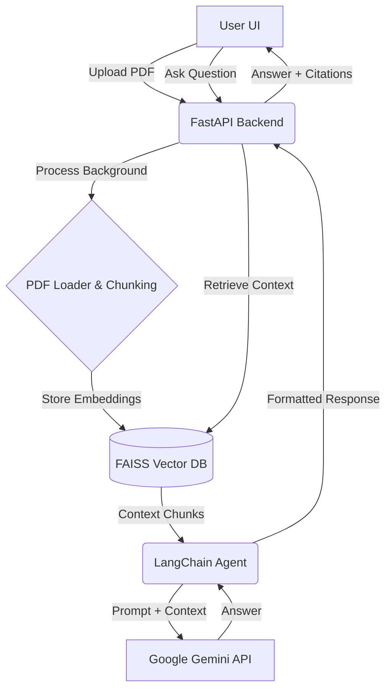

# DocuQA | PDF Chatbot Platform


A production-ready SaaS application allowing users to upload PDF documents and ask questions using an advanced RAG (Retrieval-Augmented Generation) pipeline powered by Generative AI.

## 🚀 Features

- **Multi-PDF Support**: Upload multiple documents and search across all of them simultaneously.
- **Advanced RAG Pipeline**: Intelligent text chunking, embedding generation, and fast vector search.
- **Accurate Citations**: Answers include references to the specific page number and document name.
- **Modern SaaS UI**: Responsive, beautiful interface built with pure HTML/CSS/JS (no heavy frontend frameworks).
- **Dark/Light Mode**: First-class support for theming.
- **Production Ready Backend**: Asynchronous FastAPI implementation.
- **DevOps Ready**: Docker and Kubernetes configurations included out of the box.

## 🏗 Architecture Diagram



## 🛠 Tech Stack

**Frontend:**
- HTML5, Vanilla CSS3 (Custom Design System)
- Vanilla JavaScript (Async/Await Fetch API)

**Backend:**
- Python 3.10+, FastAPI
- LangChain framework
- Google Gemini API (LLM & Embeddings)
- PyMuPDF / LangChain PyPDFLoader
- FAISS (Vector Store)

**DevOps:**
- Docker & Docker Compose
- Nginx
- Kubernetes Manifests

## ⚙️ Setup & Installation

### 1. Prerequisites
- Python 3.10+
- Docker and Docker Compose (optional for containerized deployment)
- API Key from [Google AI Studio](https://aistudio.google.com/)

### 2. Local Setup

Clone the repository:
```bash
git clone https://github.com/your-username/pdf-chatbot.git
cd pdf-chatbot
```

Setup Environment variables:
```bash
cp .env.example .env
# Edit .env and add your GEMINI_API_KEY
```

Install Backend Dependencies:
```bash
cd backend
python -m venv venv
source venv/bin/activate  # On Windows: venv\Scripts\activate
pip install -r requirements.txt
```

Run Backend:
```bash
uvicorn main:app --reload --host 0.0.0.0 --port 8000
```

Run Frontend:
You can simply open `frontend/index.html` in your browser or use a simple HTTP server:
```bash
cd ../frontend
python -m http.server 3000
```
Navigate to `http://localhost:3000`

### 3. Docker Deployment

```bash
docker-compose up --build -d
```
The application will be available at `http://localhost`.

## 📚 API Documentation

Once the backend is running, visit:
- **Swagger UI**: `http://localhost:8000/docs`
- **ReDoc**: `http://localhost:8000/redoc`

### Key Endpoints:
- `POST /upload-pdf`: Upload multiple PDF files.
- `POST /chat`: Send a query and receive an answer with citations.
- `GET /history`: Fetch current session chat history.
- `DELETE /chat-history`: Clear chat history.
- `GET /health`: System health check.
- `GET /metrics`: Basic usage metrics.

## 🚢 Kubernetes Deployment

1. Create a secret for your API key:
```bash
kubectl create secret generic pdf-chatbot-secrets --from-literal=gemini-api-key="your-api-key"
```

2. Apply manifests:
```bash
kubectl apply -f k8s/deployment.yaml
kubectl apply -f k8s/service.yaml
```

## 🐛 Troubleshooting

- **Missing Vector DB error**: Ensure the `backend/vector_store_db` directory is writable.
- **Empty Responses**: Check if you have uploaded a valid text-based PDF. Scanned PDFs without OCR may yield empty text.

## 🗺 Future Roadmap
- [ ] Implement OCR for scanned PDFs (Tesseract).
- [ ] Add User Authentication (OAuth / JWT).
- [ ] Implement Stripe for SaaS billing tiers.
- [ ] Add Postgres database for persistent user chat history.
- [ ] Export summary to DOCX/PDF.
